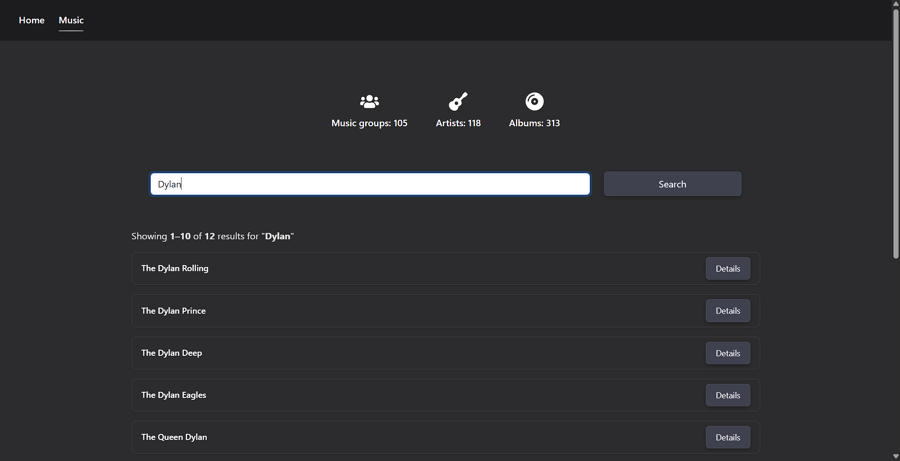

# Seekbeat v2 – Music Discovery App (React)

A responsive music discovery webapp built with **React**, **CSS**, and a **RESTful Web API**.  
This is version 2 of the Seekbeat project, refactored from vanilla JavaScript to React as part of a school assignment.

## Features

- Fetches and displays music groups via API
- Search functionality
- Pagination (10 results per page)
- Responsive design for mobile & desktop
- Detail modal with:
  - Genre
  - Year established
  - Artists
  - Albums
- Custom statistics section
- Styled using CSS and Bootstrap utilities

## Installation

bash:

- npm install
- npm start

## 📸 Screenshots

### Home Page

### Music Page

### Modal with Details

